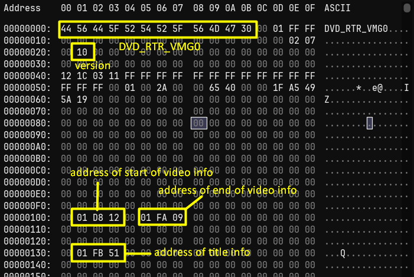
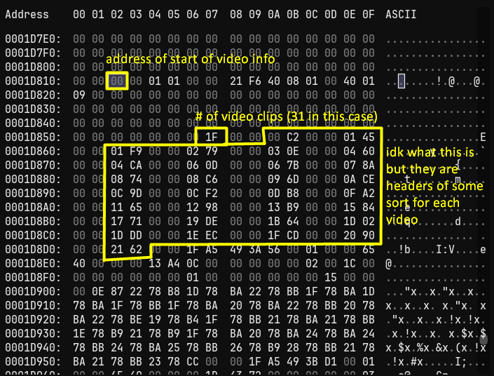
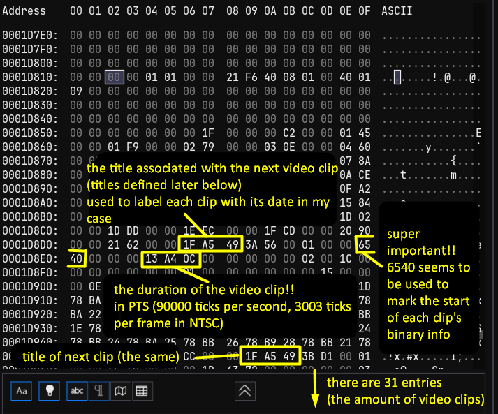
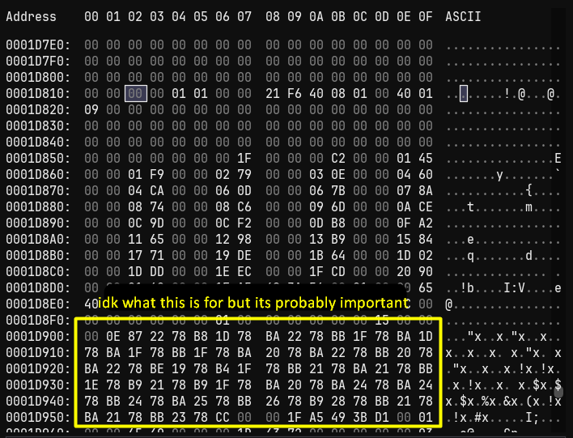
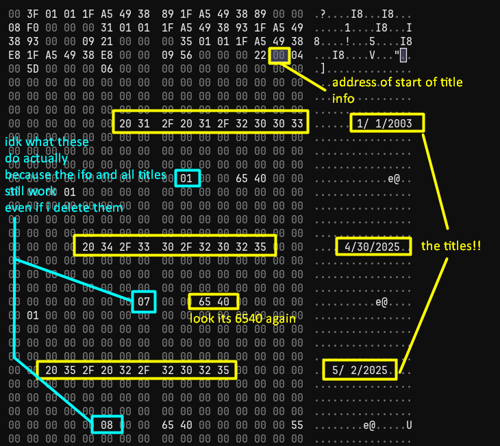

[Visit the webpage](https://www.spinningbanana.com/other/splitter)

# Overview

This program splits .VRO files into their individual clips by reading the binary of .IFO files and 
extracting useful data, then using ffmpeg to split the .VRO into .mpg files without re-encoding.

A downside with my approach is that a few frames from the next clip may be included in each clip.
There is however an offset variable that you can adjust to mitigate this and it works pretty well at stopping
it from happening.

I'm not sure how many variations of .VRO files there are, but this program for those with accompanying .IFO files that are 
of type "DVD_RTR_VMG0". You can tell what type an .IFO is by reading the first 12 bytes of its binary.

# Build it yourself

The command I use to build is the following:

`pyinstaller --onefile --noconsole --icon=icon.ico --add-data "icon.ico:." --add-data "logo.png:." splitter.py`

# My findings about the format

I was not able to find any documentation of this file format anywhere, so I had to reverse-engineer it.
There is 100% a better way to split .VRO files, for instance, TMPGEnc does a much better job but is not free
and I have no clue how it works.

However, I was able to find out a lot about .IFO files, but I was not able to figure out how to split .VROs
directly from their binary, hence the ffmpeg cop-out.

For the headers, my hypothesis is that they are used to navigate through the .VRO file's binary, but I have no clue
what to do with them

I later discovered that 0x6540 is not always used as a marker. I have also seen 0x32A0 in its place

  
If you think this is cool, [donations](https://ko-fi.com/spinningbanana) are appreciated!